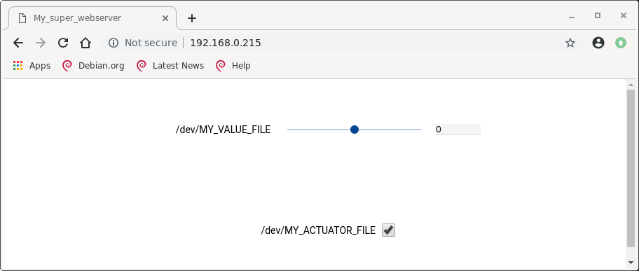

webserver generator
===================

Introduction
------------
The webserver generator is design to automatically generate a base of webserver script based on REMI, to control the tunable parameters of the IPs.


Dependencies
------------
- REMI python package https://github.com/dddomodossola/remi.git
- lxml python package
- zlib python3 package
- liboscimp_fgpa python wrap (see [fpga_lib](https://github.com/oscimp/lib/)) in ``/usr/lib/python3.9/site-packages/``

Test it
-------
* clone REMI repo and add it to buildroot

`cp Makefile %your_REMI_repo`

`make install_python_package` or `make install_python_package_ssh IP=XXX.XXX.XXX.XXX`

* build the webserver application by providing the XML configuration file myproject.xml: this configuration file is the 
same than the one used to configure [module generator](https://github.com/oscimp/app/tree/master/tools/module_generator).

`./webserver_generator myproject.xml`


Structure
---------

The webserver works through the C coded functions associated to each IP, visible in the /oscimpDigital/lib/my\_lib.h library files. 
Example of functions with a generic driver "fpgagen":

```C
fpgagen_send_conf(char *filename, int reg, int value); 
fpgagen_recv_conf(char *filename, int reg, int *value);
```

Those functions can be implemented in a REMI python based graphic interface using the python wrapper liboscimp_fpga.py (https://github.com/oscimp/lib/blob/master/liboscimp_fpga.py). 
Example of function implemented in liboscimp_fpga.py to configure the IPs: 

```python
import liboscimp_fpga
liboscimp_fpga.fpgagen_send_conf("/dev/my_file", my_reg, my_value)
```

In the webserver, values sent to the IPs can either take the form of slider, a spinbox, a checkbox, a button... In our case, a simple actuator will be represented by a checkbox, and any other controllable value by both a slider and a spinbox. The structure of the webserver is as follows:

```python

!/usr/bin/env python

import liboscimp_fpga
import ctypes
import remi.gui as gui
from remi import start, App

class MyApp(App):
	def __init__(self, *args):
		super(MyApp, self).__init__(*args)

	def main(self):
		self.w = gui.VBox()

		#Create the slider and the spinbox, whose value is restricted to -8192 to 8191 (no overflow)
		self.hbox_MY_VALUE = gui.HBox(margin="10px")
		self.lb_MY_VALUE = gui.Label("/dev/MY_VALUE_FILE", width="20%", margin="50px")
		self.sd_MY_VALUE = gui.Slider(0, -8192, 8191, 1, width="60%", margin="10px")
		self.sd_MY_VALUE.set_oninput_listener(self.sd_MY_VALUE_changed)
		self.sb_MY_VALUE = gui.SpinBox(0, -8192, 8191, 1, width="20%", margin="10px")
		self.sb_MY_VALUE.set_on_change_listener(self.sb_MY_VALUE_changed)
		self.sd_MY_VALUE_changed(self.sd_MY_VALUE, self.sd_MY_VALUE.get_value())
		self.hbox_MY_VALUE.append(self.lb_MY_VALUE)
		self.hbox_MY_VALUE.append(self.sd_MY_VALUE)
		self.hbox_MY_VALUE.append(self.sb_MY_VALUE)
		self.w.append(self.hbox_MY_VALUE)

		#Create the checkbox
		self.hbox_MY_ACTUATOR = gui.HBox(margin="10px")
		self.lb_MY_ACTUATOR = gui.Label("/dev/MY_ACTUATOR_FILE", width="20%", margin="50px")
		self.cb_MY_ACTUATOR = gui.CheckBox(True, width="5%", margin="10px")
		self.cb_MY_ACTUATOR.set_on_change_listener(self.cb_MY_ACTUATOR_changed)
		self.hbox_MY_ACTUATOR.append(self.lb_MY_ACTUATOR)
		self.hbox_MY_ACTUATOR.append(self.cb_MY_ACTUATOR)
		self.w.append(self.hbox_MY_ACTUATOR)

		return self.w

	#Function called by the slider
	def sd_MY_VALUE_changed(self, widget, value):
		print("/dev/MY_VALUE_FILE", MY_REG, int(value))
		liboscimp_fpga.fpgagen_send_conf("/dev/MY_VALUE_FILE", MY_REG, int(value))
		self.sb_MY_VALUE.set_value(int(value))

	#Function called by the spinbox
	def sb_MY_VALUE_changed(self, widget, value):
		print("/dev/MY_VALUE_FILE", MY_REG, int(value))
		liboscimp_fpga.fpgagen_send_conf("/dev/MY_VALUE_FILE", MY_REG, int(value))
		self.sd_MY_VALUE.set_value(int(float(value)))

	#Function called by the checkbox
	def sb_MY_ACTUATOR_changed(self, widget, value):
		print("/dev/MY_ACTUATOR_FILE", MY_REG, int(value))
		liboscimp_fpga.fpgagen_send_conf("/dev/MY_ACTUATOR_FILE", MY_REG2, int(value))
		self.sd_adc1_offset.set_value(int(float(value)))

#Launch oh the webserver on the local machine
start(MyApp, address="0.0.0.0", port=80, title="My_super_webserver")

```

Preview of the webserver created: 



Here the generic driver fpgagen is used as an example, however the use of a different driver can lead to various requirements: arguments, data type, or several functions. See the oscimpDigital/lib/my\_lib.h library files.
